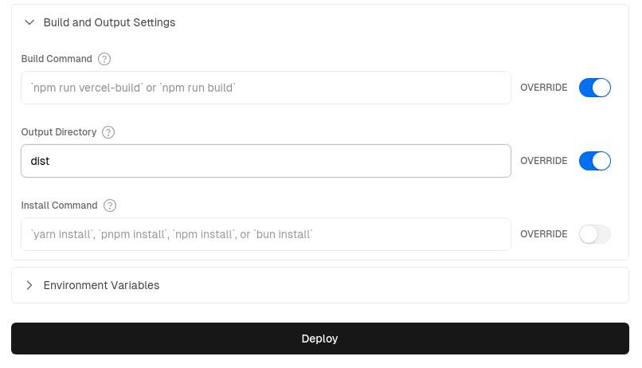

# 部署客户端渲染的应用程序

如果你一直在构建一个仅使用客户端渲染的应用程序，使用 Trunk 作为开发服务器和构建工具，那么这个过程非常简单。

```bash
trunk build --release
```

`trunk build` 将在 `dist/` 目录中创建许多构建工件。将 `dist` 发布到网上的某个地方应该是部署你的应用程序所需的全部内容。这应该与部署任何 JavaScript 应用程序非常相似。

我们创建了几个示例存储库，展示了如何设置 Leptos CSR 应用程序并将其部署到各种托管服务。

_注意：Leptos 不认可使用任何特定的托管服务——你可以随意使用任何支持静态站点部署的服务。_

示例：

- [部署客户端渲染的应用程序](#部署客户端渲染的应用程序)
	- [Github Pages](#github-pages)
	- [Vercel](#vercel)
		- [步骤 1：设置 Vercel](#步骤-1设置-vercel)
		- [步骤 2：为 GitHub Actions 添加 Vercel 凭据](#步骤-2为-github-actions-添加-vercel-凭据)
		- [步骤 3：添加 Github Action 脚本](#步骤-3添加-github-action-脚本)
	- [Spin - 无服务器 WebAssembly](#spin---无服务器-webassembly)

## Github Pages

将 Leptos CSR 应用程序部署到 Github Pages 是一件很简单的事情。首先，转到你的 Github 仓库的设置，然后点击左侧菜单中的“页面”。在页面的“构建和部署”部分，将“来源”更改为“Github Actions”。然后将以下内容复制到文件 `.github/workflows/gh-pages-deploy.yml` 中

```admonish example collapsible=true

    name: Release to Github Pages

    on:
      push:
        branches: [main]
      workflow_dispatch:

    permissions:
      contents: write # 允许写入 gh-pages 分支。
      pages: write
      id-token: write

    # 只允许一个并发部署，跳过正在进行的运行和最新排队的运行之间排队的运行。
    # 但是，不要取消正在进行的运行，因为我们希望允许这些生产部署完成。
    concurrency:
      group: "pages"
      cancel-in-progress: false

    jobs:
      Github-Pages-Release:

        timeout-minutes: 10

        environment:
          name: github-pages
          url: ${{ steps.deployment.outputs.page_url }}

        runs-on: ubuntu-latest

        steps:
          - uses: actions/checkout@v4 # 检出代码库

          # 安装 Rust Nightly 工具链，包括 Clippy 和 Rustfmt
          - name: Install nightly Rust
            uses: dtolnay/rust-toolchain@nightly
            with:
              components: clippy, rustfmt

          - name: Add WASM target
            run: rustup target add wasm32-unknown-unknown

          - name: lint
            run: cargo clippy & cargo fmt


          # 如果使用 tailwind...
          # - name: Download and install tailwindcss binary
          #   run: npm install -D tailwindcss && npx tailwindcss -i <INPUT/PATH.css> -o <OUTPUT/PATH.css>  # 运行 tailwind


          - name: Download and install Trunk binary
            run: wget -qO- https://github.com/trunk-rs/trunk/releases/download/v0.18.4/trunk-x86_64-unknown-linux-gnu.tar.gz | tar -xzf-

          - name: Build with Trunk
            # "${GITHUB_REPOSITORY#*/}" 计算为存储库的名称
            # 使用 --public-url something 将允许 trunk 修改所有 href 路径，例如从 favicon.ico 到 repo_name/favicon.ico 。
            # 这对于将站点部署到 username.github.io/repo_name 的 github pages 是必要的，并且所有文件都必须作为 favicon.ico 相对请求。
            # 如果我们跳过 public-url 选项，href 路径将改为请求 username.github.io/favicon.ico，这显然会返回错误 404 未找到。
            run: ./trunk build --release --public-url "${GITHUB_REPOSITORY#*/}"


          # 部署到 gh-pages 分支
          # - name: Deploy 🚀
          #   uses: JamesIves/github-pages-deploy-action@v4
          #   with:
          #     folder: dist


          # 使用 Github 静态页面部署

          - name: Setup Pages
            uses: actions/configure-pages@v4
            with:
              enablement: true
              # token:

          - name: Upload artifact
            uses: actions/upload-pages-artifact@v2
            with:
              # 上传 dist 目录
              path: './dist'

          - name: Deploy to GitHub Pages 🚀
            id: deployment
            uses: actions/deploy-pages@v3

```

有关部署到 Github Pages 的更多信息，[请参阅此处的示例仓库](https://github.com/diversable/deploy_leptos_csr_to_gh_pages)

## Vercel

### 步骤 1：设置 Vercel

在 Vercel Web UI 中...

1. 创建一个新项目
2. 确保
   - “构建命令” 留空，并启用覆盖
   - “输出目录” 更改为 dist（这是 Trunk 构建的默认输出目录），并启用覆盖



### 步骤 2：为 GitHub Actions 添加 Vercel 凭据

注意：预览和部署操作都需要在 GitHub secrets 中设置你的 Vercel 凭据

1. 通过转到“帐户设置”>“令牌”并创建一个新令牌来获取你的 [Vercel 访问令牌](https://vercel.com/guides/how-do-i-use-a-vercel-api-access-token) - 保存该令牌以在下面的子步骤 5 中使用。

2. 使用 `npm i -g vercel` 命令安装 [Vercel CLI](https://vercel.com/cli)，然后运行 `vercel login` 登录到你的帐户。

3. 在你的文件夹中，运行 `vercel link` 创建一个新的 Vercel 项目；在 CLI 中，你将被问到“链接到现有项目吗？” - 回答是，然后输入你在步骤 1 中创建的名称。将为你创建一个新的 `.vercel` 文件夹。

4. 在生成的 `.vercel` 文件夹中，打开 `project.json` 文件并保存“projectId”和“orgId”以用于下一步。

5. 在 GitHub 中，转到仓库的“设置”>“密钥和变量”>“操作”，并将以下内容添加为 [仓库密钥](https://docs.github.com/en/actions/security-guides/encrypted-secrets)：
   - 将你的 Vercel 访问令牌（来自子步骤 1）保存为 `VERCEL_TOKEN` 密钥
   - 从 `.vercel/project.json` 添加“projectID”作为 `VERCEL_PROJECT_ID`
   - 从 `.vercel/project.json` 添加“orgId”作为 `VERCEL_ORG_ID`

<i>有关完整说明，请参阅 [“如何在 Vercel 中使用 Github Actions”](https://vercel.com/guides/how-can-i-use-github-actions-with-vercel)</i>

### 步骤 3：添加 Github Action 脚本

最后，你只需从下方或 [示例仓库的 `.github/workflows/` 文件夹](https://github.com/diversable/vercel-leptos-CSR-deployment/tree/leptos_0.6/.github/workflows) 中复制粘贴这两个文件——一个用于部署，一个用于 PR 预览——到你的 Github 工作流文件夹中，然后，在你的下一次提交或 PR 时，部署将自动进行。

<i>生产部署脚本：`vercel_deploy.yml`</i>

```admonish example collapsible=true

 name: 发布到 Vercel

 on:
 push:
  branches:
  - main
 env:
 CARGO_TERM_COLOR: always
 VERCEL_ORG_ID: ${{ secrets.VERCEL_ORG_ID }}
 VERCEL_PROJECT_ID: ${{ secrets.VERCEL_PROJECT_ID }}

 jobs:
 Vercel-Production-Deployment:
  runs-on: ubuntu-latest
  environment: production
  steps:
  - name: git-checkout
   uses: actions/checkout@v3

  - uses: dtolnay/rust-toolchain@nightly
   with:
   components: clippy, rustfmt
  - uses: Swatinem/rust-cache@v2
  - name: 设置 Rust
   run: |
   rustup target add wasm32-unknown-unknown
   cargo clippy
   cargo fmt --check

  - name: 下载并安装 Trunk 二进制文件
   run: wget -qO- https://github.com/trunk-rs/trunk/releases/download/v0.18.2/trunk-x86_64-unknown-linux-gnu.tar.gz | tar -xzf-


  - name: 使用 Trunk 构建
   run: ./trunk build --release

  - name: 安装 Vercel CLI
   run: npm install --global vercel@latest

  - name: 拉取 Vercel 环境信息
   run: vercel pull --yes --environment=production --token=${{ secrets.VERCEL_TOKEN }}

  - name: 部署到 Vercel 并显示 URL
   id: deployment
   working-directory: ./dist
   run: |
   vercel deploy --prod --token=${{ secrets.VERCEL_TOKEN }} >> $GITHUB_STEP_SUMMARY
   echo $GITHUB_STEP_SUMMARY

```

<i>预览部署脚本：`vercel_preview.yml`</i>

```admonish example collapsible=true

 # 有关 Vercel 操作的更多信息，请参阅：
 # https://github.com/amondnet/vercel-action

 name: Leptos CSR Vercel 预览

 on:
 pull_request:
  branches: [ "main" ]

 workflow_dispatch:

 env:
 CARGO_TERM_COLOR: always
 VERCEL_ORG_ID: ${{ secrets.VERCEL_ORG_ID }}
 VERCEL_PROJECT_ID: ${{ secrets.VERCEL_PROJECT_ID }}

 jobs:
 fmt:
  name: Rustfmt
  runs-on: ubuntu-latest
  steps:
  - uses: actions/checkout@v4
  - uses: dtolnay/rust-toolchain@nightly
   with:
   components: rustfmt
  - name: 强制格式化
   run: cargo fmt --check

 clippy:
  name: Clippy
  runs-on: ubuntu-latest
  steps:
  - uses: actions/checkout@v4
  - uses: dtolnay/rust-toolchain@nightly
   with:
   components: clippy
  - uses: Swatinem/rust-cache@v2
  - name: Lint
   run: cargo clippy -- -D warnings

 test:
  name: 测试
  runs-on: ubuntu-latest
  needs: [fmt, clippy]
  steps:
  - uses: actions/checkout@v4
  - uses: dtolnay/rust-toolchain@nightly
  - uses: Swatinem/rust-cache@v2
  - name: 运行测试
   run: cargo test

 build-and-preview-deploy:
  runs-on: ubuntu-latest
  name: 构建和预览

  needs: [test, clippy, fmt]

  permissions:
  pull-requests: write

  environment:
  name: preview
  url: ${{ steps.preview.outputs.preview-url }}

  steps:
  - name: git-checkout
   uses: actions/checkout@v4

  - uses: dtolnay/rust-toolchain@nightly
  - uses: Swatinem/rust-cache@v2
  - name: 构建
   run: rustup target add wasm32-unknown-unknown

  - name: 下载并安装 Trunk 二进制文件
   run: wget -qO- https://github.com/trunk-rs/trunk/releases/download/v0.18.2/trunk-x86_64-unknown-linux-gnu.tar.gz | tar -xzf-


  - name: 使用 Trunk 构建
   run: ./trunk build --release

  - name: 预览部署
   id: preview
   uses: amondnet/vercel-action@v25.1.1
   with:
   vercel-token: ${{ secrets.VERCEL_TOKEN }}
   github-token: ${{ secrets.GITHUB_TOKEN }}
   vercel-org-id: ${{ secrets.VERCEL_ORG_ID }}
   vercel-project-id: ${{ secrets.VERCEL_PROJECT_ID }}
   github-comment: true
   working-directory: ./dist

  - name: 显示已部署 URL
   run: |
   echo "已部署的应用程序 URL：${{ steps.preview.outputs.preview-url }}" >> $GITHUB_STEP_SUMMARY


```

有关更多信息，请参阅 [此处的示例仓库](https://github.com/diversable/vercel-leptos-CSR-deployment)。

## Spin - 无服务器 WebAssembly

另一种选择是使用 Spin 等无服务器平台。虽然 [Spin](https://github.com/fermyon/spin) 是开源的，你可以在自己的基础设施上运行它（例如在 Kubernetes 内部），但在生产环境中开始使用 Spin 最简单的方法是使用 Fermyon Cloud。

首先按照 [此处的说明](https://developer.fermyon.com/spin/v2/install) 安装 Spin CLI，并为你的 Leptos CSR 项目创建一个 Github 仓库（如果你还没有这样做）。

1. 打开“Fermyon Cloud”>“用户设置”。如果你尚未登录，请选择“使用 GitHub 登录”按钮。

2. 在“个人访问令牌”中，选择“添加令牌”。输入名称“gh_actions”并单击“创建令牌”。

3. Fermyon Cloud 将显示该令牌；单击复制按钮将其复制到剪贴板。

4. 进入你的 Github 仓库，打开“设置”>“密钥和变量”>“操作”，并将 Fermyon 云令牌添加到“存储库密钥”中，使用变量名“FERMYON_CLOUD_TOKEN”

5. 将以下 Github Actions 脚本（如下）复制并粘贴到你的 `.github/workflows/<SCRIPT_NAME>.yml` 文件中

6. 激活“预览”和“部署”脚本后，Github Actions 现在将在拉取请求时生成预览，并在更新到“主”分支时自动部署。

<i>生产部署脚本：`spin_deploy.yml`</i>

```admonish example collapsible=true

 # 有关 Fermyon Cloud 所需的设置说明，请参阅：
 # https://developer.fermyon.com/cloud/github-actions

 # 供参考，请参阅：
 # https://developer.fermyon.com/cloud/changelog/gh-actions-spin-deploy

 # 对于 Fermyon gh 操作本身，请参阅：
 # https://github.com/fermyon/actions

 name: 发布到 Spin Cloud

 on:
 push:
  branches: [main]
 workflow_dispatch:

 permissions:
 contents: read
 id-token: write

 # 仅允许一个并发部署，跳过正在运行的运行和最新排队的运行之间排队的运行。
 # 但是，不要取消正在进行的运行，因为我们希望允许这些生产部署完成。
 concurrency:
 group: "spin"
 cancel-in-progress: false

 jobs:
 Spin-Release:

  timeout-minutes: 10

  environment:
  name: production
  url: ${{ steps.deployment.outputs.app-url }}

  runs-on: ubuntu-latest

  steps:
  - uses: actions/checkout@v4 # repo checkout

  # 安装 Rust Nightly 工具链，包括 Clippy 和 Rustfmt
  - name: 安装 nightly Rust
   uses: dtolnay/rust-toolchain@nightly
   with:
   components: clippy, rustfmt

  - name: 添加 WASM 和 WASI 目标
   run: rustup target add wasm32-unknown-unknown && rustup target add wasm32-wasi

  - name: lint
   run: cargo clippy & cargo fmt


  # 如果使用 tailwind...
  # - name: 下载并安装 tailwindcss 二进制文件
  #   run: npm install -D tailwindcss && npx tailwindcss -i <INPUT/PATH.css> -o <OUTPUT/PATH.css>  # 运行 tailwind


  - name: 下载并安装 Trunk 二进制文件
   run: wget -qO- https://github.com/trunk-rs/trunk/releases/download/v0.18.2/trunk-x86_64-unknown-linux-gnu.tar.gz | tar -xzf-


  - name: 使用 Trunk 构建
   run: ./trunk build --release


  # 安装 Spin CLI 并部署

  - name: 设置 Spin
   uses: fermyon/actions/spin/setup@v1
   # with:
   # plugins:


  - name: 构建和部署
   id: deployment
   uses: fermyon/actions/spin/deploy@v1
   with:
   fermyon_token: ${{ secrets.FERMYON_CLOUD_TOKEN }}
   # key_values: |-
    # abc=xyz
    # foo=bar
   # variables: |-
    # password=${{ secrets.SECURE_PASSWORD }}
    # apikey=${{ secrets.API_KEY }}

  # 创建一条显式消息以显示已部署应用程序的 URL，以及在作业图中显示
  - name: 已部署的 URL
   run: |
   echo "已部署的应用程序 URL：${{ steps.deployment.outputs.app-url }}" >> $GITHUB_STEP_SUMMARY

```

<i>预览部署脚本：`spin_preview.yml`</i>

```admonish example collapsible=true

 # 有关 Fermyon Cloud 所需的设置说明，请参阅：
 # https://developer.fermyon.com/cloud/github-actions


 # 对于 Fermyon gh 操作本身，请参阅：
 # https://github.com/fermyon/actions

 # 具体来说：
 # https://github.com/fermyon/actions?tab=readme-ov-file#deploy-preview-of-spin-app-to-fermyon-cloud---fermyonactionsspinpreviewv1

 name: 在 Spin Cloud 上预览

 on:
 pull_request:
  branches: ["main", "v*"]
  types: ['opened', 'synchronize', 'reopened', 'closed']
 workflow_dispatch:

 permissions:
 contents: read
 pull-requests: write

 # 仅允许一个并发部署，跳过正在运行的运行和最新排队的运行之间排队的运行。
 # 但是，不要取消正在进行的运行，因为我们希望允许这些生产部署完成。
 concurrency:
 group: "spin"
 cancel-in-progress: false

 jobs:
 Spin-Preview:

  timeout-minutes: 10

  environment:
  name: preview
  url: ${{ steps.preview.outputs.app-url }}

  runs-on: ubuntu-latest

  steps:
  - uses: actions/checkout@v4 # repo checkout

  # 安装 Rust Nightly 工具链，包括 Clippy 和 Rustfmt
  - name: 安装 nightly Rust
   uses: dtolnay/rust-toolchain@nightly
   with:
   components: clippy, rustfmt

  - name: 添加 WASM 和 WASI 目标
   run: rustup target add wasm32-unknown-unknown && rustup target add wasm32-wasi

  - name: lint
   run: cargo clippy & cargo fmt


  # 如果使用 tailwind...
  # - name: 下载并安装 tailwindcss 二进制文件
  #   run: npm install -D tailwindcss && npx tailwindcss -i <INPUT/PATH.css> -o <OUTPUT/PATH.css>  # 运行 tailwind


  - name: 下载并安装 Trunk 二进制文件
   run: wget -qO- https://github.com/trunk-rs/trunk/releases/download/v0.18.2/trunk-x86_64-unknown-linux-gnu.tar.gz | tar -xzf-


  - name: 使用 Trunk 构建
   run: ./trunk build --release


  # 安装 Spin CLI 并部署

  - name: 设置 Spin
   uses: fermyon/actions/spin/setup@v1
   # with:
   # plugins:


  - name: 构建和预览
   id: preview
   uses: fermyon/actions/spin/preview@v1
   with:
   fermyon_token: ${{ secrets.FERMYON_CLOUD_TOKEN }}
   github_token: ${{ secrets.GITHUB_TOKEN }}
   undeploy: ${{ github.event.pull_request && github.event.action == 'closed' }}
   # key_values: |-
    # abc=xyz
    # foo=bar
   # variables: |-
    # password=${{ secrets.SECURE_PASSWORD }}
    # apikey=${{ secrets.API_KEY }}


  - name: 显示已部署 URL
   run: |
   echo "已部署的应用程序 URL：${{ steps.preview.outputs.app-url }}" >> $GITHUB_STEP_SUMMARY

```

请参阅 [此处的示例仓库](https://github.com/diversable/leptos-spin-CSR)。
